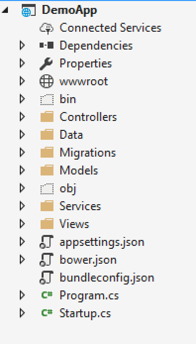
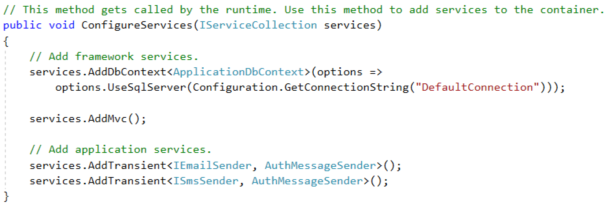
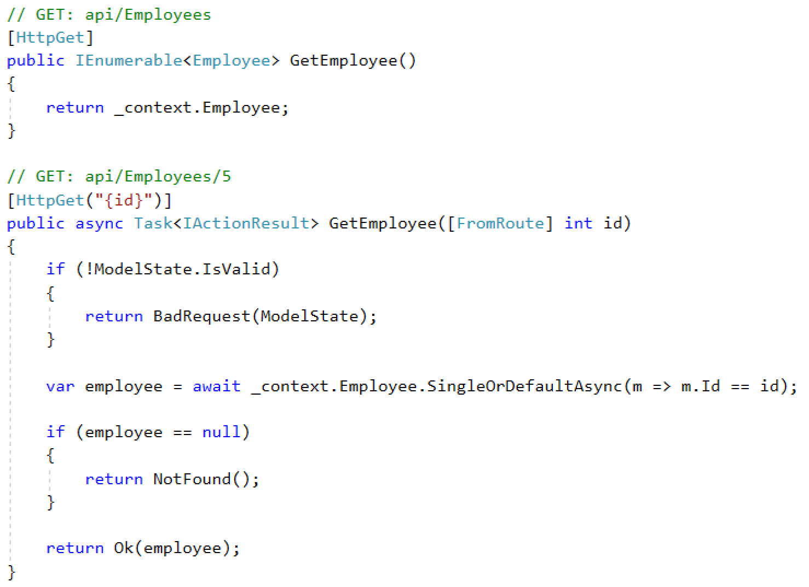
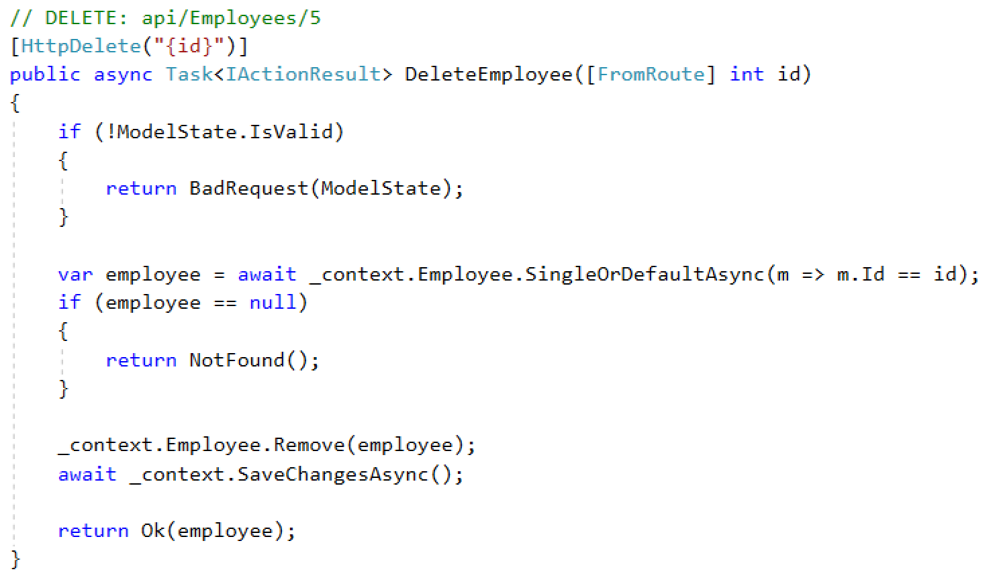

### An <span style="color: #e49436">Opinionated</span> and <span style="color: #e49436">Maintainable</span> REST API Architecture for <span class="orange">ASP.NET Core</span>

#####  Spencer Schneidenbach

[@schneidenbach](https://twitter.com/schneidenbach)  

---

Twitter [@schneidenbach](https://twitter.com/schneidenbach)  

## Slides plus more at

rest.schneids.net

---

## <span class="orange">Setting the stage</span>

"We need a new SPA"  
"We need a new REST API"

---

## <span class="orange">ASP.NET Core</span>

###### (or "old" ASP.NET MVC/Web API)

---

## Zero to <span class="orange">"make magic happen"</span>

---

is it done yet

---

Scaffolding

---

The promise
## Scaffolding is amazing

Productivity! Awesomeness!

---

The reality
## Scaffolding is a lie

---

## <span class="orange">Controller</span> is a one man army
Route the request  
Validate  
Run service for request  
Return data

---

## No <span class="orange">separation of concerns</span>

---

## <span class="orange">Controller</span> needs to be
Route the request  
Return data

---

## Let's take a tour

---
Attendees will learn about dependency injection, validating requests, executing requests via services, error handling, and versioning strategies to make sure your API lasts for the long haul.
---

## Introducing the Employee

```csharp
public class Employee
{
    public int Id { get; set; }
    [Required]
    public string FirstName { get; set; }
    [Required]
    public string LastName { get; set; }
    public DateTime DateOfBirth { get; set; }
    public DateTime DateOfHire { get; set; }
    public string SocialSecurityNumber { get; set; }
}
```

---

## The Employee Object

* Is part of payroll software
* Contains sensitive data (SSN)

---

## You, the Developer(tm)

* Loves Visual Studio tooling
* Loves to get stuff done

---

## ASP.NET Core + Entity Framework Core

###### (or ASP.NET Web API + EF6)
###### (or ASP.NET Web API + a database)
###### (or ASP.NET Web API + whatever)

---

## File -> New Project



---

## <span class="orange">Startup.cs</span>



---


---


---


---


---

## A wild <span class="orange">EmployeeController</span> appeared

---


---



---


---


---



---

## What's wrong with this?

---

## Controller is doing <span class="orange">everything!</span>

---

So let's break it apart

---

## <span class="orange">CQRS</span>  
Command Query Responsibility Segregation

---

Bottom line - move:
- Validation
- Running service
somewhere else

---

## <span class="orange">Why?</span>
- Reusability
- Separation of concerns
- Easier testing

---

Let's start with validation

---

```csharp
public class Employee
{
    public int Id { get; set; }
    [Required]
    public string FirstName { get; set; }
    [Required]
    public string LastName { get; set; }
    public DateTime DateOfBirth { get; set; }
    public DateTime DateOfHire { get; set; }
    public string SocialSecurityNumber { get; set; }
}
```
---

Problem?
## Model/model validation are not separate

---

## <span class="orange">Clunky</span> to run and validate  
(especially outside of ASP.NET)

---

TODO: validation pic

---

# Rule 1: separate model and validation

## Introducing FluentValidation

### <span class="yellow">WARNING - OPINION</span>

---

### More resources

rest.schneids.net

---

## Thank you!

[@schneidenbach](https://twitter.com/schneidenbach)  
schneids.net